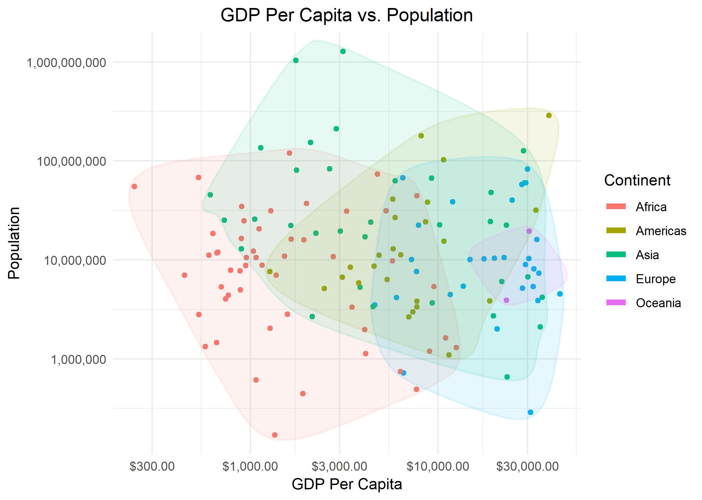
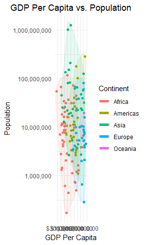

```{r setup, include=FALSE}
knitr::opts_chunk$set(echo = TRUE)
```

# Overview

Taken from the [homework HTML file](http://stat545.com/Classroom/assignments/hw05/hw05.html), here are the goals for this assignment:


- Reorder a factor in a principled way based on the data and demonstrate the effect in arranged data and in figures.

- Write some data to file and load it back into R.

- Improve a figure (or make one from scratch), using new knowledge, e.g., control the color scheme, use factor levels, smoother mechanics.

- Make a plotly visual.

- Implement visualization design principles.

# Part 1: Factor Management

First things first, load all of our packages.

```{r packages}
suppressPackageStartupMessages(library("gapminder"))
suppressPackageStartupMessages(library("tidyverse"))
suppressPackageStartupMessages(library("singer"))
suppressPackageStartupMessages(library("scales"))
suppressPackageStartupMessages(library("ggalt"))
suppressPackageStartupMessages(library("plotly"))
```

## Elaborating Gapminder Dataset

Before manipulating the levels of gapminder, let's first check the columns are actually factors and then look at some numbers so we can do a before/after comparison.

```{r before dropping}
nrow(gapminder)

cont <- gapminder$continent

is.factor(cont)
nlevels(cont)
levels(cont)
```

```{r after dropped}
no_Oceania <- gapminder %>%
  filter(continent != "Oceania") %>%
  droplevels()
  
nlevels(no_Oceania$continent)
levels(no_Oceania$continent)
nrow(no_Oceania)
```

We can plot the before and after data frames to see the difference. 

```{r Oceania not dropped}
gapminder %>%
  mutate(continent = fct_reorder(continent, gdpPercap, .fun = min)) %>%
  ggplot(aes(continent, gdpPercap)) +
  geom_jitter(colour = "darkblue", alpha = 0.3) +
  scale_y_log10(labels=comma_format()) + 
  labs(y = "GDP Per Capita", x = "Continent", title = "GDP Per Capita of Continents Before Dropping Oceania") +
  theme(plot.title = element_text(hjust = 0.5)) +
  theme_minimal()
```


```{r Oceania dropped}
no_Oceania %>%
  mutate(continent = fct_reorder(continent, gdpPercap, .fun = min)) %>%
  ggplot(aes(continent, gdpPercap)) +
  geom_jitter(colour = "orange", alpha = 0.3) +
  scale_y_log10(labels=comma_format()) + 
  labs(y = "GDP Per Capita", x = "Continent", title = "GDP Per Capita of Continents After Dropping Oceania") +
  theme(plot.title = element_text(hjust = 0.5)) +
  theme_minimal()
```

Clearly, the GDP per Capita no longer plots Oceania as it has been dropped.


We can try `arrange()` as well with gdpPercap, which would be the same as using `fct_reorder` with the default`mean` function.

```{r no Oceania plot}
no_Oceania %>%
  arrange(gdpPercap) %>%
  ggplot(aes(continent, gdpPercap)) +
  geom_jitter(colour = "darkgreen", alpha = 0.3) +
  scale_y_log10(labels=comma_format()) + 
  labs(y = "GDP Per Capita", x = "Continent", title = "GDP Per Capita of Continents Arranged by Mean") +
  theme(plot.title = element_text(hjust = 0.5)) +
  theme_minimal()

```

## Elaborating Singer Dataset

Let's have a quick look at the structure of the `singer_locations` dataset.

```{r singer dataset}
head(singer_locations)
nrow(singer_locations)
```

We can see that none of the columns are currently factors, so let's convert the year column into a factor before dropping any data.

```{r factor year}
# Using the base R function
singerFactorYear1 <- singer_locations %>%
  mutate(year = as.factor(year))

# Using the forcats function
singerFactorYear2 <- singer_locations %>%
  mutate(year = as_factor(as.character(year)))

tibble("as.factor()" = singerFactorYear1$year,
       "as_factor()" = singerFactorYear2$year) %>%
  head() %>%
  knitr::kable()

```


The forcats `as_factor()` function is more strict than the base r `as.factor` function, so we need to coerce the integer years to characters before coercing them to a factor. the order of both functions are the same in this case, but its alway's good to check for surprises.

Now we can move onto dropping the "0" years.

```{r drop 0 years}
singerFixedYears <- singerFactorYear1 %>%
  filter(year != 0) %>%
  mutate(year = fct_drop(year))

nrow(singerFixedYears)

any(levels(singerFixedYears) == 0)
```

Remembering from before, we originally had 10100 entries in the `singer_locations` dataset, and now the number has decreased. As well, the unused level "0" has been dropped.

Now, let's try rearranging `artist_name` to show which songs had the highest "hotness" score.

```{r reordering}
# Before reorder
artistsFactors <- singer_locations %>%
  mutate(artist_name = as_factor(artist_name))

notReordered<- artistsFactors$artist_name %>%
  levels() %>%
  head()

# After reorder
hottestArtists <- artistsFactors %>%
  mutate(artist_name = fct_reorder(artist_name, artist_hotttnesss, .fun = max))

reordered <- hottestArtists$artist_name %>%
  levels() %>%
  head()

# Compare results
tibble("Not Reordered" = notReordered, "Reordered By Hotness" = reordered) %>%
  knitr::kable()
```

Good job, Freelance Hellraiser.

# Part 2: File I/O

Let's save the `hottestArtists` data we arranged to a CSV file and see if it's stil arranged after reading it again.

```{r save to csv}
hottestArtists$artist_name %>%
  levels() %>%
  write.csv("hottestArtists.csv")

read.csv("hottestArtists.csv") %>%
  head() %>%
  knitr::kable()
```

Success! We still have the artists ordered by hotness. We can experiment with the base r I/O functions as well.

```{r base r I/O}
# Mix them up just for fun
shuffledArtists <- hottestArtists %>%
  mutate(artist_name = fct_shuffle(artist_name))

beforeIO <- shuffledArtists$artist_name %>%
  levels() %>%
  head()

# Code copied from examples in readRDS documenation
fil <- tempfile("shuffledArtists", fileext = ".rds")

## save a single object to file
saveRDS(shuffledArtists, fil)

## restore it under a different name
shuffledArtists2 <- readRDS(fil)

afterIO <- shuffledArtists2$artist_name %>%
  levels() %>%
  head()

tibble("Before I/O" = beforeIO, "After I/O" = afterIO) %>%
  knitr::kable()
```

Great, still didn't lose the new ordering.

# Part 3: Visualization Design

Let's bring together what we've learned about `scales`, theming and coloring in `ggplot2`, and some extra aesthetics I found [online](http://r-statistics.co/Top50-Ggplot2-Visualizations-MasterList-R-Code.html#Scatterplot%20With%20Encircling).

```{r pretty plot}
prettyPlot <- gapminder %>%
  filter(year == 2002) %>%
  select(continent, pop, gdpPercap) %>%
  ggplot(aes(y = pop, x = gdpPercap, colour=continent)) +
  geom_point() +
  geom_encircle(aes(fill = continent), alpha = 0.1, size = 2, expand = 0.01) + 
  guides(fill = FALSE) + 
  scale_y_log10(labels = comma_format()) +
  scale_x_log10(labels = dollar_format()) +
  theme_minimal() +
  labs(x = "GDP Per Capita", y = "Population", title = "GDP Per Capita vs. Population", colour = "Continent") +
  theme(plot.title = element_text(hjust = 0.5))

prettyPlot
```

Now render it as a Plotly graph.

```{r plotly graph code, eval = FALSE}
prettyPlot %>%
  ggplotly() %>%
  htmlwidgets::saveWidget("prettyPlot.html")
```

```{r plotly graph, include = FALSE}
# I didn't want all of the ugly error messages printing to the output file and couldn't find a way to suppress it,
# so I have one code chunk to show the code and one to run it. Not the best but gets the job done.
prettyPlot %>%
  ggplotly() %>%
  htmlwidgets::saveWidget("prettyPlot.html")
```

[You can download the plot in HTML here](prettyPlot.html). Unfortunately `geom_encircle()` hasn't been implemented in plotly but we still get a good looking graph with the interactivity that you don't get from `ggplot2` alone. 

# Part 4: Writing Figures to File

Let's save that last plot to file. 

```{r save to file}
ggsave("prettyPlot.png", plot = prettyPlot)
```

Note that I needed to explicitly `plot = prettyPlot` here, because the last plot was the HTML plotly file, which the `ggsave()` function can't handle. Here it is as a .png:



We can of course set the width and height, as atrocious as you wish.

```{r set width/height}
ggsave("prettyPlot2.png", plot = prettyPlot, width = 3, height = 5, dpi = 100)
```

