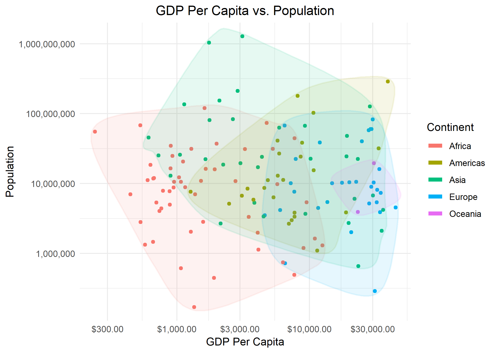
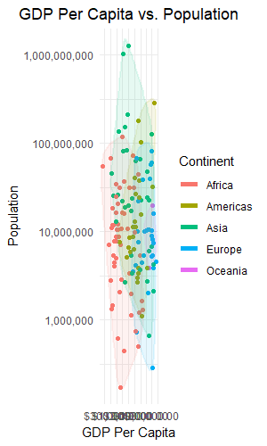

Homework 05: Factor and Figure Management
================
Aidan Hughes
October 17, 2018

-   [Overview](#overview)
-   [Part 1: Factor Management](#part-1-factor-management)
    -   [Elaborating Gapminder Dataset](#elaborating-gapminder-dataset)
    -   [Elaborating Singer Dataset](#elaborating-singer-dataset)
-   [Part 2: File I/O](#part-2-file-io)
-   [Part 3: Visualization Design](#part-3-visualization-design)
-   [Part 4: Writing Figures to File](#part-4-writing-figures-to-file)

Overview
========

Taken from the [homework HTML file](http://stat545.com/Classroom/assignments/hw05/hw05.html), here are the goals for this assignment:

-   Reorder a factor in a principled way based on the data and demonstrate the effect in arranged data and in figures.

-   Write some data to file and load it back into R.

-   Improve a figure (or make one from scratch), using new knowledge, e.g., control the color scheme, use factor levels, smoother mechanics.

-   Make a plotly visual.

-   Implement visualization design principles.

Part 1: Factor Management
=========================

First things first, load all of our packages.

``` r
suppressPackageStartupMessages(library("gapminder"))
suppressPackageStartupMessages(library("tidyverse"))
suppressPackageStartupMessages(library("singer"))
suppressPackageStartupMessages(library("scales"))
suppressPackageStartupMessages(library("ggalt"))
suppressPackageStartupMessages(library("plotly"))
```

Elaborating Gapminder Dataset
-----------------------------

Before manipulating the levels of gapminder, let's first check the columns are actually factors and then look at some numbers so we can do a before/after comparison.

``` r
nrow(gapminder)
```

    ## [1] 1704

``` r
cont <- gapminder$continent

is.factor(cont)
```

    ## [1] TRUE

``` r
nlevels(cont)
```

    ## [1] 5

``` r
levels(cont)
```

    ## [1] "Africa"   "Americas" "Asia"     "Europe"   "Oceania"

``` r
no_Oceania <- gapminder %>%
  filter(continent != "Oceania") %>%
  droplevels()
  
nlevels(no_Oceania$continent)
```

    ## [1] 4

``` r
levels(no_Oceania$continent)
```

    ## [1] "Africa"   "Americas" "Asia"     "Europe"

``` r
nrow(no_Oceania)
```

    ## [1] 1680

We can plot the before and after data frames to see the difference.

``` r
gapminder %>%
  mutate(continent = fct_reorder(continent, gdpPercap, .fun = min)) %>%
  ggplot(aes(continent, gdpPercap)) +
  geom_jitter(colour = "darkblue", alpha = 0.3) +
  scale_y_log10(labels=comma_format()) + 
  labs(y = "GDP Per Capita", x = "Continent", title = "GDP Per Capita of Continents Before Dropping Oceania") +
  theme(plot.title = element_text(hjust = 0.5)) +
  theme_minimal()
```


``` r
no_Oceania %>%
  mutate(continent = fct_reorder(continent, gdpPercap, .fun = min)) %>%
  ggplot(aes(continent, gdpPercap)) +
  geom_jitter(colour = "orange", alpha = 0.3) +
  scale_y_log10(labels=comma_format()) + 
  labs(y = "GDP Per Capita", x = "Continent", title = "GDP Per Capita of Continents After Dropping Oceania") +
  theme(plot.title = element_text(hjust = 0.5)) +
  theme_minimal()
```


Clearly, the GDP per Capita no longer plots Oceania as it has been dropped.

We can try `arrange()` as well with gdpPercap, which would be the same as using `fct_reorder` with the default`mean` function.

``` r
no_Oceania %>%
  arrange(gdpPercap) %>%
  ggplot(aes(continent, gdpPercap)) +
  geom_jitter(colour = "darkgreen", alpha = 0.3) +
  scale_y_log10(labels=comma_format()) + 
  labs(y = "GDP Per Capita", x = "Continent", title = "GDP Per Capita of Continents Arranged by Mean") +
  theme(plot.title = element_text(hjust = 0.5)) +
  theme_minimal()
```


Elaborating Singer Dataset
--------------------------

Let's have a quick look at the structure of the `singer_locations` dataset.

``` r
head(singer_locations)
```

    ## # A tibble: 6 x 14
    ##   track_id title song_id release artist_id artist_name  year duration
    ##   <chr>    <chr> <chr>   <chr>   <chr>     <chr>       <int>    <dbl>
    ## 1 TRWICRA~ The ~ SOSURT~ Even I~ ARACDPV1~ Motion Cit~  2007     170.
    ## 2 TRXJANY~ Lone~ SODESQ~ The Du~ ARYBUAO1~ Gene Chand~  2004     107.
    ## 3 TRIKPCA~ Here~ SOQUYQ~ Improm~ AR4111G1~ Paul Horn    1998     528.
    ## 4 TRYEATD~ Rego~ SOEZGR~ Still ~ ARQDZP31~ Ronnie Ear~  1995     695.
    ## 5 TRBYYXH~ Games SOPIOC~ Afro-H~ AR75GYU1~ Dorothy As~  1968     237.
    ## 6 TRKFFKR~ More~ SOHQSP~ Six Ya~ ARCENE01~ Barleyjuice  2006     193.
    ## # ... with 6 more variables: artist_hotttnesss <dbl>,
    ## #   artist_familiarity <dbl>, latitude <dbl>, longitude <dbl>, name <chr>,
    ## #   city <chr>

``` r
nrow(singer_locations)
```

    ## [1] 10100

We can see that none of the columns are currently factors, so let's convert the year column into a factor before dropping any data.

``` r
# Using the base R function
singerFactorYear1 <- singer_locations %>%
  mutate(year = as.factor(year))

# Using the forcats function
singerFactorYear2 <- singer_locations %>%
  mutate(year = as_factor(as.character(year)))

tibble("as.factor()" = singerFactorYear1$year,
       "as_factor()" = singerFactorYear2$year) %>%
  head() %>%
  knitr::kable()
```

| as.factor() | as\_factor() |
|:------------|:-------------|
| 2007        | 2007         |
| 2004        | 2004         |
| 1998        | 1998         |
| 1995        | 1995         |
| 1968        | 1968         |
| 2006        | 2006         |

The forcats `as_factor()` function is more strict than the base r `as.factor` function, so we need to coerce the integer years to characters before coercing them to a factor. the order of both functions are the same in this case, but its alway's good to check for surprises.

Now we can move onto dropping the "0" years.

``` r
singerFixedYears <- singerFactorYear1 %>%
  filter(year != 0) %>%
  mutate(year = fct_drop(year))

nrow(singerFixedYears)
```

    ## [1] 10000

``` r
any(levels(singerFixedYears) == 0)
```

    ## [1] FALSE

Remembering from before, we originally had 10100 entries in the `singer_locations` dataset, and now the number has decreased. As well, the unused level "0" has been dropped.

Now, let's try rearranging `artist_name` to show which songs had the highest "hotness" score.

``` r
# Before reorder
artistsFactors <- singer_locations %>%
  mutate(artist_name = as_factor(artist_name))

notReordered<- artistsFactors$artist_name %>%
  levels() %>%
  head()

# After reorder
hottestArtists <- artistsFactors %>%
  mutate(artist_name = fct_reorder(artist_name, artist_hotttnesss, .fun = max))

reordered <- hottestArtists$artist_name %>%
  levels() %>%
  head()

# Compare results
tibble("Not Reordered" = notReordered, "Reordered By Hotness" = reordered) %>%
  knitr::kable()
```

| Not Reordered                  | Reordered By Hotness                       |
|:-------------------------------|:-------------------------------------------|
| Motion City Soundtrack         | The Freelance Hellraiser                   |
| Gene Chandler                  | Col. Bruce Hampton and the Late Bronze Age |
| Paul Horn                      | The Jancee Pornick Casino                  |
| Ronnie Earl & the Broadcasters | Elliott Sharp\`s Terraplane                |
| Dorothy Ashby                  | Main Concept                               |
| Barleyjuice                    | Jessie Lee Miller                          |

Good job, Freelance Hellraiser.

Part 2: File I/O
================

Let's save the `hottestArtists` data we arranged to a CSV file and see if it's stil arranged after reading it again.

``` r
hottestArtists$artist_name %>%
  levels() %>%
  write.csv("hottestArtists.csv")

read.csv("hottestArtists.csv") %>%
  head() %>%
  knitr::kable()
```

|    X| x                                          |
|----:|:-------------------------------------------|
|    1| The Freelance Hellraiser                   |
|    2| Col. Bruce Hampton and the Late Bronze Age |
|    3| The Jancee Pornick Casino                  |
|    4| Elliott Sharp\`s Terraplane                |
|    5| Main Concept                               |
|    6| Jessie Lee Miller                          |

Success! We still have the artists ordered by hotness. We can experiment with the base r I/O functions as well.

``` r
# Mix them up just for fun
shuffledArtists <- hottestArtists %>%
  mutate(artist_name = fct_shuffle(artist_name))

beforeIO <- shuffledArtists$artist_name %>%
  levels() %>%
  head()

# Code copied from examples in readRDS documenation
fil <- tempfile("shuffledArtists", fileext = ".rds")

## save a single object to file
saveRDS(shuffledArtists, fil)

## restore it under a different name
shuffledArtists2 <- readRDS(fil)

afterIO <- shuffledArtists2$artist_name %>%
  levels() %>%
  head()

tibble("Before I/O" = beforeIO, "After I/O" = afterIO) %>%
  knitr::kable()
```

| Before I/O                                                                  | After I/O                                                                   |
|:----------------------------------------------------------------------------|:----------------------------------------------------------------------------|
| Robert Wyatt                                                                | Robert Wyatt                                                                |
| Atlantic Starr                                                              | Atlantic Starr                                                              |
| Enrico Rava\_ Stefano Bollani\_ Mark Turner\_ Larry Grenadier\_ Paul Motian | Enrico Rava\_ Stefano Bollani\_ Mark Turner\_ Larry Grenadier\_ Paul Motian |
| Inner City Unit                                                             | Inner City Unit                                                             |
| Too Pure To Die                                                             | Too Pure To Die                                                             |
| Brian Melo                                                                  | Brian Melo                                                                  |

Great, still didn't lose the new ordering.

Part 3: Visualization Design
============================

Let's bring together what we've learned about `scales`, theming and coloring in `ggplot2`, and some extra aesthetics I found [online](http://r-statistics.co/Top50-Ggplot2-Visualizations-MasterList-R-Code.html#Scatterplot%20With%20Encircling).

``` r
prettyPlot <- gapminder %>%
  filter(year == 2002) %>%
  select(continent, pop, gdpPercap) %>%
  ggplot(aes(y = pop, x = gdpPercap, colour=continent)) +
  geom_point() +
  geom_encircle(aes(fill = continent), alpha = 0.1, size = 2, expand = 0.01) + 
  guides(fill = FALSE) + 
  scale_y_log10(labels = comma_format()) +
  scale_x_log10(labels = dollar_format()) +
  theme_minimal() +
  labs(x = "GDP Per Capita", y = "Population", title = "GDP Per Capita vs. Population", colour = "Continent") +
  theme(plot.title = element_text(hjust = 0.5))

prettyPlot
```


Now render it as a Plotly graph.

``` r
prettyPlot %>%
  ggplotly() %>%
  htmlwidgets::saveWidget("prettyPlot.html")
```

[You can download the plot in HTML here](prettyPlot.html). Unfortunately `geom_encircle()` hasn't been implemented in plotly but we still get a good looking graph with the interactivity that you don't get from `ggplot2` alone.

Part 4: Writing Figures to File
===============================

Let's save that last plot to file.

``` r
ggsave("prettyPlot.png", plot = prettyPlot)
```

    ## Saving 7 x 5 in image

Note that I needed to explicitly `plot = prettyPlot` here, because the last plot was the HTML plotly file, which the `ggsave()` function can't handle. Here it is as a .png:



We can of course set the width and height, as atrocious as you wish.

``` r
ggsave("prettyPlot2.png", plot = prettyPlot, width = 3, height = 5, dpi = 100)
```


