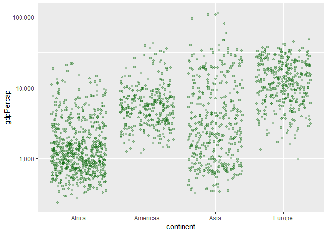

Homework 05: Factor and Figure Management
================
Aidan Hughes
October 17, 2018

-   [Overview](#overview)
-   [Part 1: Factor Management](#part-1-factor-management)

Overview
========

Taken from the [homework HTML file](http://stat545.com/Classroom/assignments/hw05/hw05.html), here are the goals for this assignment:

-   Reorder a factor in a principled way based on the data and demonstrate the effect in arranged data and in figures.

-   Write some data to file and load it back into R.

-   Improve a figure (or make one from scratch), using new knowledge, e.g., control the color scheme, use factor levels, smoother mechanics.

-   Make a plotly visual.

-   Implement visualization design principles.

Part 1: Factor Management
=========================

First things first, load all of our packages.

``` r
suppressPackageStartupMessages(library("gapminder"))
suppressPackageStartupMessages(library("tidyverse"))
suppressPackageStartupMessages(library("singer"))
suppressPackageStartupMessages(library("scales"))
```

Before manipulating the levels of gapminder, let's first check the columns are actually factors and then look at some numbers so we can do a before/after comparison.

``` r
nrow(gapminder)
```

    ## [1] 1704

``` r
cont <- gapminder$continent

is.factor(cont)
```

    ## [1] TRUE

``` r
nlevels(cont)
```

    ## [1] 5

``` r
levels(cont)
```

    ## [1] "Africa"   "Americas" "Asia"     "Europe"   "Oceania"

``` r
no_Oceania <- gapminder %>%
  filter(continent != "Oceania") %>%
  droplevels()
  
nlevels(no_Oceania$continent)
```

    ## [1] 4

``` r
levels(no_Oceania$continent)
```

    ## [1] "Africa"   "Americas" "Asia"     "Europe"

``` r
nrow(no_Oceania)
```

    ## [1] 1680

We can plot the before and after data frames to see the difference.

``` r
gapminder %>%
  mutate(continent = fct_reorder(continent, gdpPercap, .fun = min)) %>%
  ggplot(aes(continent, gdpPercap)) +
  geom_jitter(colour = "darkblue", alpha = 0.3) +
  scale_y_log10(labels=comma_format()) + 
  labs(y = "GDP Per Capita", x = "Continent", title = "GDP Per Capita of Continents Before Dropping Oceania") +
  theme(plot.title = element_text(hjust = 0.5)) +
  theme_minimal()
```


``` r
no_Oceania %>%
  mutate(continent = fct_reorder(continent, gdpPercap, .fun = min)) %>%
  ggplot(aes(continent, gdpPercap)) +
  geom_jitter(colour = "orange", alpha = 0.3) +
  scale_y_log10(labels=comma_format())
```


Clearly, the GDP per Capita no longer plots Oceania as it has been dropped.

We can try `arrange()` as well with gdpPercap, which would be the same as using `fct_reorder` with the function set as `mean`.

``` r
no_Oceania %>%
  arrange(gdpPercap) %>%
  ggplot(aes(continent, gdpPercap)) +
  geom_jitter(colour = "darkgreen", alpha = 0.3) +
  scale_y_log10(labels=comma_format())
```


